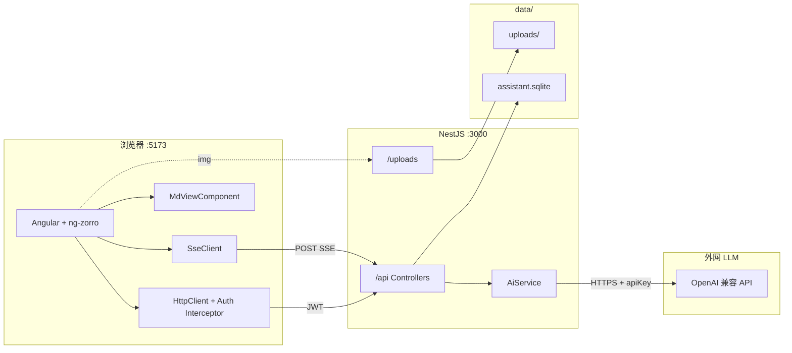
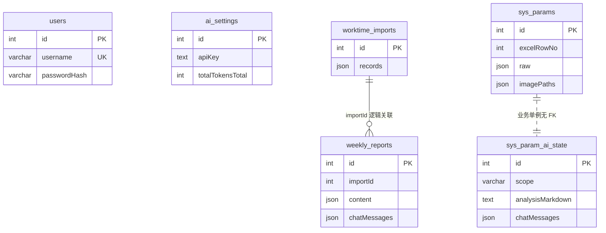
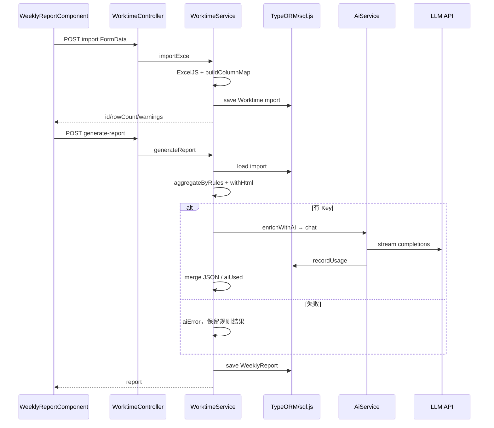
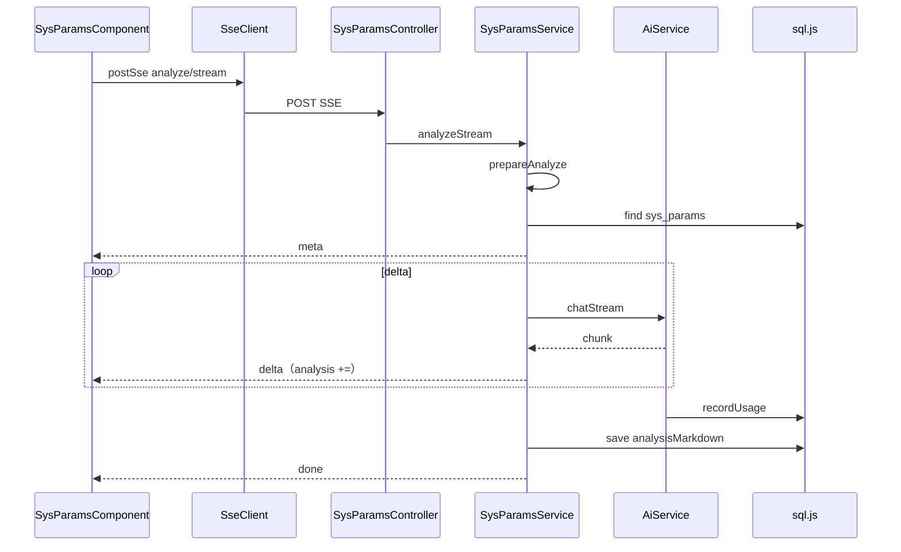
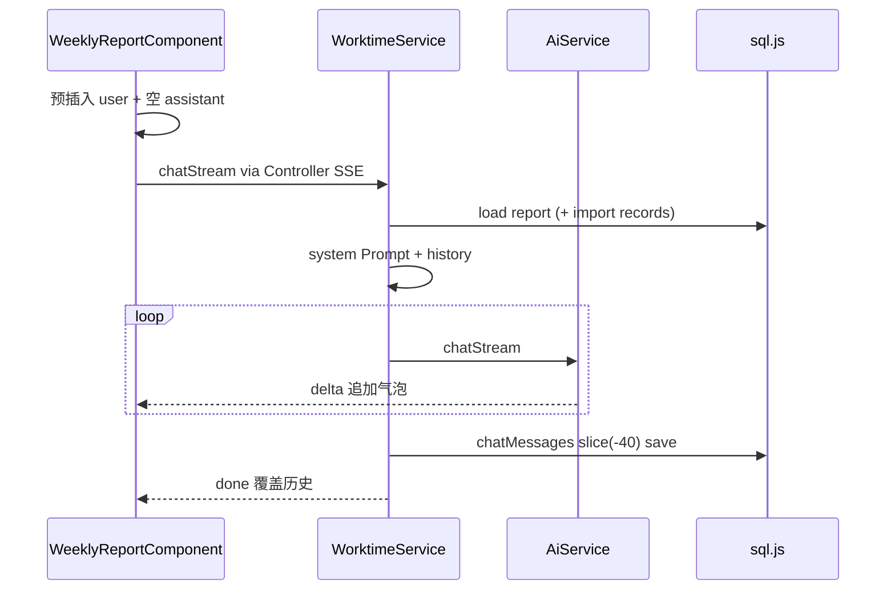

# 个人研发效能助手 — 系统消化文档

> 面向项目原作者：对照源码重新理解系统。  
> 技术栈：Angular 19.2 + NestJS Fastify + Prisma SQLite + OpenAI 兼容 AI（默认 DeepSeek）。（2026-08-07 已从 TypeORM/sql.js/Express 迁出）  
> 关联：[CONTEXT.md](../CONTEXT.md) · [技术方案.md](./技术方案.md)

---

## 1. 整体架构

### 1.1 概览

本地单机、前后端分离：浏览器跑 Angular；本机 NestJS 提供 `/api` 与静态 `/uploads`；数据落在仓库根目录 SQLite 文件；AI 由后端按配置的 OpenAI 兼容地址发 HTTP，**Key 不进前端**。

| 菜单 | 路由 | 能力 |
|------|------|------|
| 工时周报 | `/weekly-report` | Excel → 规则周报 + 可选 AI 润色/对话 |
| 配置洞察 | `/system-config-params` | 参数 Excel → 表/图 + SSE AI 分析/对话 |
| 系统配置 | `/settings` | Provider / BaseURL / Model / Key + Token 用量 |

### 1.2 技术栈职责

| 层 | 技术 | 职责 |
|----|------|------|
| 前端 | Angular 19.2 + ng-zorro | 页面、守卫、HttpClient、SSE、Markdown |
| 后端 | NestJS | REST + SSE；全局前缀 `api`；CORS 仅 `5173` |
| ORM | Prisma | `schema.prisma` + migrate；Client 注入 `PrismaService` |
| DB | SQLite 文件 | `apps/data/assistant.prisma.sqlite`（`DATABASE_URL`） |
| 文件 | `data/uploads/` | Excel 抽图等 → `/uploads` |
| AI | `{baseUrl}/v1/chat/completions` | 封装于 `apps/api/src/ai/ai.service.ts` |

端口：API `3000`，Web `5173`。

### 1.3 数据库（Prisma SQLite）

跑在 NestJS 服务端，持久化到 `apps/data/assistant.prisma.sqlite`（`paths.ts` → `DB_FILE` / `DATABASE_URL`）。

2026-08-07 起由 Prisma 管理 schema 与 migration；HTTP 层为 Fastify。旧 sql.js 库若存在会备份为 `assistant.sqljs.bak`，业务数据不自动迁移。上云多实例后再切 PostgreSQL。

### 1.4 架构图



### 1.5 目录总览

```text
assistant/
├── apps/web/src/app/
│   ├── core/api/api-base.ts          # API_BASE / UPLOADS_BASE
│   ├── core/auth/                    # AuthService / Guard / Interceptor
│   ├── layout/                       # 主布局
│   ├── pages/{login,weekly-report,sys-params,settings}/
│   └── shared/{md-view,sse-client.service}
├── apps/api/src/
│   ├── main.ts / app.module.ts
│   ├── entities/index.ts             # 全部 Entity
│   ├── auth/ settings/ ai/ worktime/ sys-params/ seed/
│   └── common/{paths,excel-map,filename,sse}.ts
├── data/                             # sqlite + uploads（常 gitignore）
├── docs/CONTEXT.md
├── docs/10001/技术方案.md
└── docs/10001/系统消化文档.md        # 本文件
```

**心智模型：** 前端薄、页面胖；后端按业务 Module；DB 是服务端文件型 SQLite；AI 可换兼容厂商。

---

## 2. 后端（NestJS）

### 2.1 Module 清单

#### AuthModule — `apps/api/src/auth/`

- Controller: `AuthController` — `POST /api/auth/login`、`GET /api/auth/me`
- Service: `AuthService.login` / `me`（bcrypt + JWT 7d）
- `JwtStrategy.validate` → `{ userId, username }`
- Entity: `User`

#### SettingsModule — `apps/api/src/settings/` + AI

- Controller: `SettingsController`（`settings/ai`）→ 委托 `AiService`
- **导出 `AiService`**（文件在 `apps/api/src/ai/ai.service.ts`，无独立 AiModule）
- Entity: `AiSetting`

| 路由 | 方法 |
|------|------|
| GET/PUT `/api/settings/ai` | `getPublicSetting` / `updateSetting` |
| POST `.../test` | `testConnection` |
| POST `.../usage/reset` | `resetUsage` |

`AiService` 核心：`getSetting`、`chat`（消费 stream）、`chatStream`（`fetch` + 解析上游 SSE + `recordUsage`）。

#### WorktimeModule — `apps/api/src/worktime/`

| 路由 | Service |
|------|---------|
| POST `import` | `importExcel` |
| GET `latest` | `latest` |
| POST `generate-report` | `generateReport` |
| PUT `reports/:id` | `updateReport` |
| POST `reports/:id/chat[/stream]` | `chat` / `chatStream` |
| POST `reports/:id/chat/clear` | `clearChat` |
| POST `reports/:id/optimize` | `optimizeSection` |

辅助：`aggregateByRules`、`enrichWithAi`、`withHtml`、`contentToMarkdown`、`parseJsonContent`（同文件）。

#### SysParamsModule — `apps/api/src/sys-params/`

| 路由 | Service |
|------|---------|
| POST `import` | `importExcel`（`clear`+`save` 全量覆盖 + 抽图） |
| GET `/` | `list`（内存 filter + `moduleStats`） |
| GET `ai-state` | `getAiState` |
| POST `analyze[/stream]` | `analyze` / `analyzeStream` |
| POST `chat[/stream]` / `chat/clear` | 对应方法 |
| GET `:id` | `detail`（静态路径须在 `:id` 前，当前正确） |

#### SeedModule — `apps/api/src/seed/`

`SeedService.onModuleInit`：无用户则建 admin；无 AI 行则建默认 DeepSeek 配置。

#### common

| 文件 | 作用 |
|------|------|
| `paths.ts` | DATA/DB/UPLOADS、JWT/管理员默认值 |
| `excel-map.ts` | 表头别名、`buildColumnMap`、缺陷判断 |
| `filename.ts` | Multer 中文名 latin1→utf8 |
| `sse.ts` | `initSse` / `writeSse` / `endSse` |

`ServeStaticModule`：`UPLOADS_DIR` → `/uploads`（**无 JWT**）。

### 2.2 Entity 关系（无 ORM 关联装饰器）



定义集中在 `apps/api/src/entities/index.ts`。

### 2.3 非常规写法

1. `AiService` 寄生 SettingsModule 并 export  
2. 非流式 API = 流式 `for await` 包装  
3. `AiService.chat` 也走上游 `stream:true`  
4. `stream_options.include_usage` 失败则降级重试  
5. 配置洞察 `list` 全表内存过滤  
6. `latest()` 的 import/report **各自最新一条，不保证成对**  
7. SSE 业务错误常仍 HTTP 200 + `{type:'error'}`  
8. `synchronize: true`；JWT/默认密码源码兜底  

---

## 3. 前端（Angular）

### 3.1 路由

`app.routes.ts`：`/login` 公开；`/` + `authGuard` → `MainLayoutComponent` 子路由 `weekly-report` / `system-config-params` / `settings`。

Provider：`app.config.ts` → `provideHttpClient(withInterceptors([authInterceptor]))`。

### 3.2 状态管理

| 方式 | 用途 |
|------|------|
| 组件字段 | 三业务页几乎全部状态 |
| `AuthService.user` signal | 唯一全局 Signal |
| localStorage | `rd_token` / `rd_user` |
| 无 NgRx / 无业务 API Service 层 | URL 写在 Component 里 |

### 3.3 横切

- `AuthService`：login / logout / token / `loadCurrentUser`（主要在 Settings 调）
- `authInterceptor`：Bearer；401 → 登出跳转
- `SseClient.postSse`：`observe:'events'` + `reportProgress` + `responseType:'text'`
- `MdViewComponent`：marked + DOMPurify
- `api-base.ts`：硬编码 `http://localhost:3000`

### 3.4 组件 ↔ API

**WeeklyReportComponent**

| 方法 | API |
|------|-----|
| `loadLatest` | GET `/worktime/latest` |
| `onFileChange` | POST `/worktime/import` |
| `generate` | POST `/worktime/generate-report` |
| `save` | PUT `/worktime/reports/:id` |
| `optimizeSection` | POST `.../optimize` |
| `sendChat` | SSE `.../chat/stream` |
| `clearChat` | POST `.../chat/clear` |
| copy/export | 本地剪贴板 |

**SysParamsComponent**

| 方法 | API |
|------|-----|
| `loadTable` / `loadAiState` | GET `/sys-params`、`/sys-params/ai-state` |
| `onFileChange` | POST `/sys-params/import` |
| `openDetail` | GET `/sys-params/:id` |
| `analyze` / `sendChat` | SSE analyze/stream、chat/stream |
| `clearChat` | POST chat/clear |

**SettingsComponent**：GET/PUT `/settings/ai`、POST test、POST usage/reset；`AI_PROVIDERS` 为前端厂商预设。

**LoginComponent**：`AuthService.login` → `/auth/login`。

---

## 4. 数据流（核心时序）

### 4.1 工时导入 → 生成周报



### 4.2 配置洞察 SSE 分析



### 4.3 周报 SSE 对话



共性：鉴权拦截器加 JWT；流式用 `common/sse.ts` ↔ `SseClient`；LLM 只经 `AiService`。

---

## 5. AI 能力集成

### 5.1 角色与触发点

| 场景 | 入口 | 形态 | 产出 |
|------|------|------|------|
| 周报生成增强 | `enrichWithAi` | `chat` | JSON |
| 分区润色 | `optimizeSection` | `chat` | HTML |
| 周报对话 | `WorktimeService.chatStream` | stream | Markdown |
| 配置分析 | `analyzeStream` | stream | Markdown |
| 配置对话 | `SysParamsService.chatStream` | stream | Markdown |
| 连通测试 | `testConnection` | `chat` | 短文本 |

无 Key：周报规则仍可用；对话/分析/润色/测试抛「未配置 API Key」。

### 5.2 封装

前端 **不**直连 LLM。业务 Service 组 `messages` → `AiService.chatStream` → `fetch(baseUrl/v1/chat/completions)`，Bearer 用库内 `apiKey`。无官方 SDK。

### 5.3 Prompt 摘要

| 场景 | System 要点 | User / 注入 | 期望 |
|------|-------------|-------------|------|
| enrichWithAi | 只输出合法 JSON | 规则参考 + 压缩明细 | JSON |
| optimizeSection | 只输出 HTML 片段 | 原始 HTML + 约束 | HTML |
| 周报对话 | 顾问 + 勿编造任务号 | 周报 MD + 工时摘要 + 历史 | MD |
| 配置分析 | 配置治理顾问 | 全量/选中提纲 + 整行 JSON(raw) | MD |
| 配置对话 | 顾问 + 勿编造配置 | 最近分析 + 最多 80 行摘要 + 历史 | MD |

传输：默认 `temperature` 0.3、`max_tokens` 4096、`stream:true`；优先 `stream_options.include_usage`。

### 5.4 解析 / 异常 / Token

- `parseJsonContent`：去 ``` 围栏后 `JSON.parse`；失败由 `generateReport` 软降级。  
- 流式业务错误：SSE `{type:'error'}`。  
- **无**结果缓存、**无**专用超时/限流处理。  
- 对话历史 `slice(-40)`；配置对话摘要最多 80 条；**分析侧未见同等截断**。  
- Token：`recordUsage` 写入 `ai_settings`；设置页可清零。

### 5.5 Key 安全

- Key 存 `ai_settings.apiKey` **明文**；前端只见 masked / configured。  
- 空 apiKey 更新不覆盖旧值。  
- 未见前端硬编码真实 Key。  
- 本地隐患：默认 JWT/密码、`/uploads` 无鉴权、sqlite 含明文 Key——勿直接公网暴露。

---

## 6. 坑与技术债

### 数据

1. `latest()` import/report 可能错配  
2. 参数 `clear`+`save` 事务体验弱  
3. `synchronize: true` 无 migration  
4. 无 FK；`SysParamAiState` 全局单行  
5. 导入抽图目录只增不清理  

### AI

6. `chat()` 实为上游 stream  
7. JSON 解析脆弱  
8. 取消 SSE 未必中止上游 fetch（待验证）  
9. 全量分析 Prompt 可能过大  
10. 重复分析重复耗 Token  

### 前端

11. 无 API Service 层，URL 散落组件  
12. `API_BASE` 硬编码  
13. 流式检测：配置洞察用 CDR，周报靠 Zone  
14. 路由名 `system-config-params` ≠「配置洞察」  
15. 登录页预填默认密码  
16. Guard 只看 token 是否存在  

### 后端 / 工程

17. AiService 目录语义易误导  
18. 非 stream 接口前端已少用  
19. `sseErrorMessage` 双份拷贝  
20. 列表内存过滤  
21. `@types/better-sqlite3` 残留  
22. 默认密钥在源码  

### 建议亲自验证

- `clear` 中途杀进程后的 sqlite 状态  
- 取消订阅后后端/上游是否停  
- 大表分析是否触上下文上限  
- `HttpDownloadProgressEvent.partialText` 在当前环境是否稳定  

---

## 附录：读代码顺序建议

1. `docs/CONTEXT.md` → 本文件 → `技术方案.md`  
2. `apps/api/src/app.module.ts` + `entities/index.ts`  
3. `ai/ai.service.ts` → `worktime.service.ts` → `sys-params.service.ts`  
4. 前端三页 Component + `sse-client.service.ts`  
5. 本地双终端按 README 跑通导入样例 `data/sample-worktime.xlsx`
